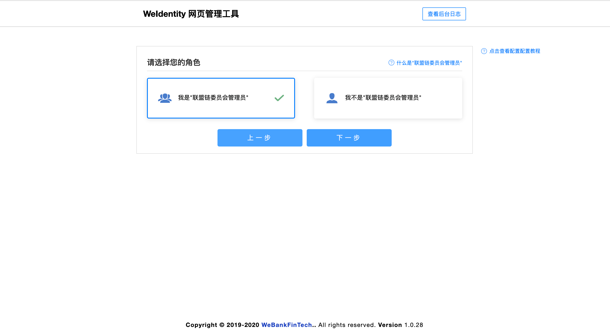
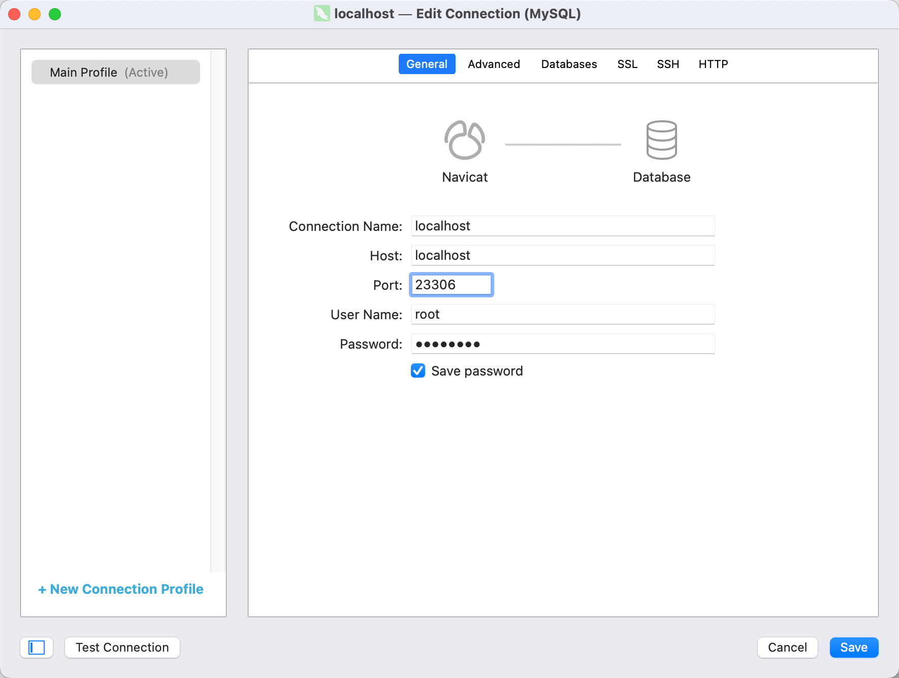
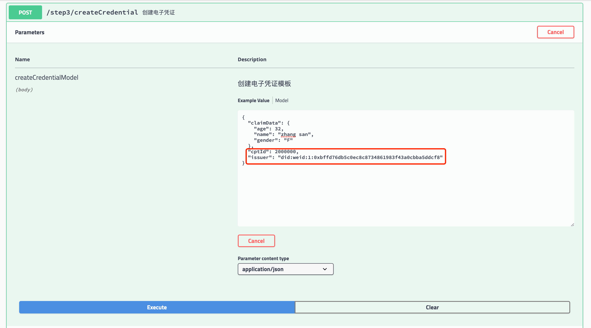

# Weidentity 一站式体验流程
版本说明
--------
* Fisco bcos版本 2.9.0
* Webase  1.5.4
* weid-build-tools  1.0.28
* weid-sample master

## 1.创建网络
```bash
docker network create -d bridge --subnet=172.25.0.0/16 --gateway=172.25.0.1 web_network
```
网络说明
--------
| 服务器名称 | IP | 内外端口 | 备注 |
| :---- | :---- | :---- | :---- |
| chain-node0 | 172.25.0.2 | 20200:20200,30300:30300 |  |
| chain-node1 | 172.25.0.3 | 20201:20200,30301:30300 |  |
| chain-node2 | 172.25.0.4 | 20202:20200,30302:30300 |  |
| webase-front | 172.25.0.5 | 5002:5002 | 访问chain-node1 20200端口 |
| webase-node-mgr | 172.25.0.6 | 5001:5001 |  |
| webase-sign| 172.25.0.7 | 5004:5004 |  |
| webase-web| 172.25.0.8 | 5000:5000 |  |
| webase-db| 172.25.0.9 | 23306:3306 | mysql 5.6 |
| weid-build-tools | 172.25.0.10 | 6021:6021 |  |
| weid-sample | 172.25.0.11 | 6101:6101 |  |

## 2.一键运行

```bash
docker-compose up -d
docker-compose ps
webase由于有依赖，如果没启动,重复执行 docker-compose up -d到全部启动为止
```


## 3.查看Webase
webase第一次初始化需要点时间，需要等待
* Webase链管理工具 http://localhost:5000/

输入默认账号密码：admin/Abcd1234

修改密码

新建应用

复制应用信息

## 4. 配置Weidentity
* Weidentity管理工具 http://localhost:6021/
WeID+Webase模式

选择角色

区块链节点配置

设置主群组

创建weid数据库


数据库配置

创建管理员WEID

Webase添加管理员账号

同步Webase账号


设置链Id,部署合约


部署完成


## 5. 访问Weid 示例
拷贝 weid-build-tools 的resources中的文件到 weid-sample
拷贝 output/admin下的文件到 weid-sample/keys/priv
```bash
cp weid-build-tools/output/admin/* weid-sample/keys/priv 
cp -r weid-build-tools/resources/* weid-sample/resources
docker restart weid-sample
```
* WeId Sample:http://localhost:6101/swagger-ui.html
访问接口文档

创建 WeID

注册 Cpt（凭证的声明类型） 参数里的 publisher 传入step1刚刚注册的WeID,注册 CPT 成功，CPT ID 为 2000000。


创建 Credential(凭证) 参数issuer为step1的``weId``，参数cptId为step2返回的``cptId``


验证 Credential    参数credential为step3所得到的``result``


## 其他：重置所有数据,重新初始化Webase,WeIdentiy
```bash
./reset.sh
```
[Weidentity可视化安装](https://weidentity.readthedocs.io/zh_CN/release-1.8.5/docs/deploy-via-web.html)


